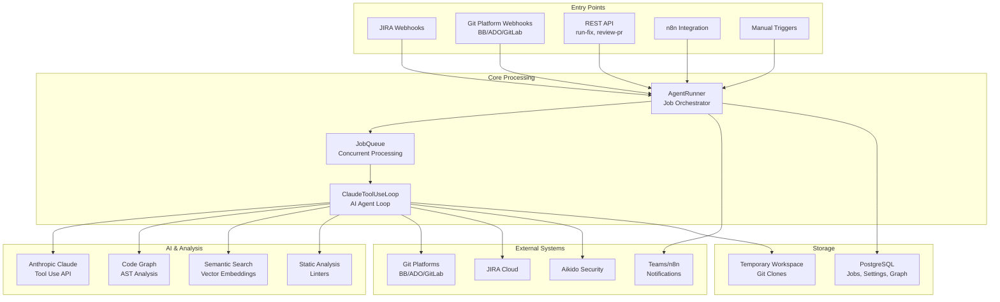
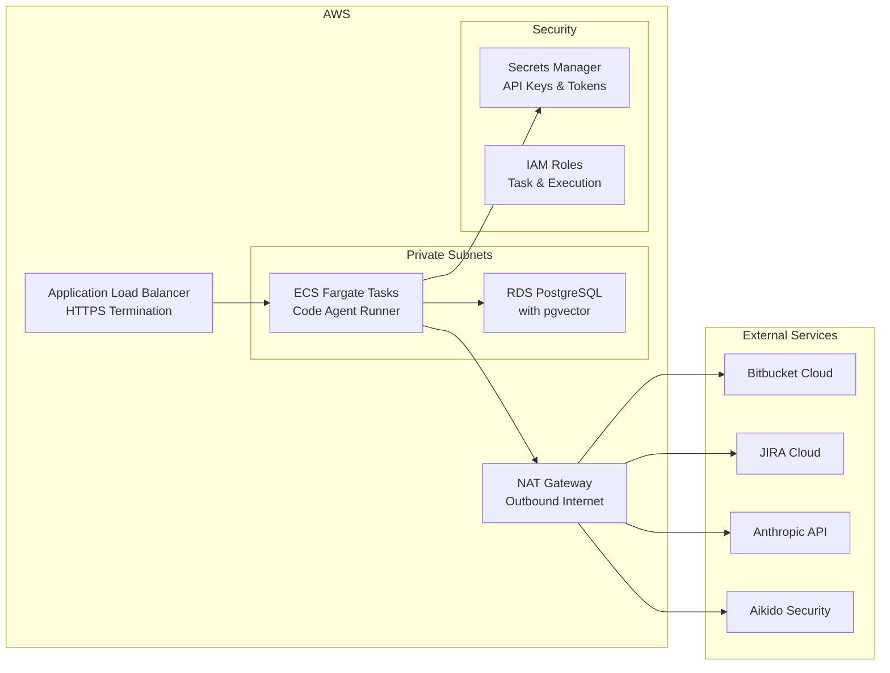
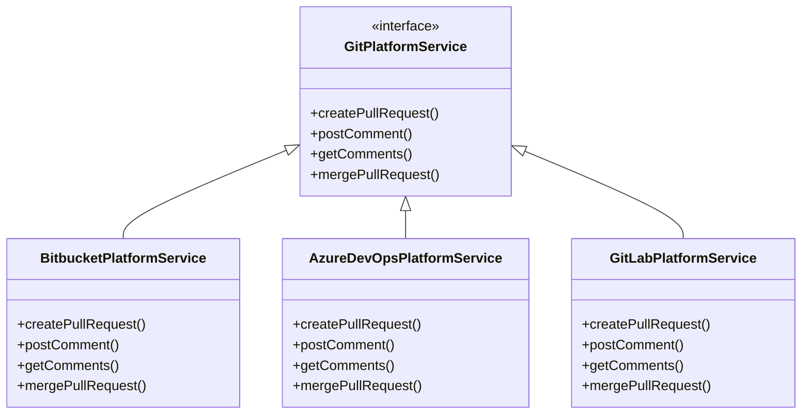

# Architecture Overview

The Code Agent Runner is designed as a scalable, self-hosted coding agent that automates software development tasks through AI-powered workflows. The system integrates with multiple platforms and services to provide comprehensive code analysis, automated fixes, and intelligent code reviews.

## High-Level System Design

The Code Agent Runner operates as a central orchestration service that receives requests from various entry points, processes them through an AI-powered agent loop, and coordinates with external systems to complete development workflows.

## Technology Stack

### Core Framework
- **Quarkus 3.17.8**: Modern Java framework providing fast startup, low memory footprint, and native compilation support
- **Java 21**: Latest LTS version with modern language features and performance improvements
- **Maven**: Build automation and dependency management

### AI Integration
- **Anthropic Claude**: Primary AI model for code analysis and generation via tool-use API
- **Claude Sonnet 4**: Default model optimized for coding tasks
- **AWS Bedrock**: Vector embeddings (`cohere.embed-multilingual-v3`) and reranking (`amazon.rerank-v1:0`) for semantic code search — GDPR-compliant, data stays in `eu-central-1`

### Data Storage
- **PostgreSQL 14+**: Primary database for persistent storage
- **pgvector**: Vector similarity search extension for semantic code search
- **Flyway**: Database migration management

### External Integrations
- **Git Platforms**: Bitbucket Cloud, Azure DevOps, GitLab (pluggable architecture)
- **JIRA Cloud**: Issue management and workflow automation
- **Aikido Security**: Vulnerability scanning and remediation context
- **Teams/n8n**: Notifications and approval workflows

### Code Analysis
- **JavaParser**: AST parsing for Java code graph generation
- **Checkstyle/PMD/SpotBugs**: Static analysis and linting
- **ESLint**: JavaScript/TypeScript linting
- **dotnet format**: C# code formatting

## System Components

### Core Services

#### AgentRunner
The central orchestrator that manages job execution lifecycles. Handles:
- Job initialization and context setup
- Git repository cloning and branch management  
- AI agent loop coordination
- Build validation (Maven/dotnet)
- PR creation and JIRA updates
- Approval workflow management

#### ClaudeToolUseLoop
Implements the agentic tool-use pattern with Claude:
- Iterative problem-solving approach
- Tool invocation (read_file, write_file, run_command, etc.)
- Context accumulation and decision making
- Rate limiting and error handling
- Guardrail enforcement

#### JobQueue
Manages concurrent job execution:
- FIFO queue with configurable capacity (default: 20 jobs)
- Parallel execution up to max concurrent limit (default: 3)
- Job status tracking and persistence
- Timeout handling and cleanup

### Code Intelligence

#### Code Graph System
Builds and maintains AST-based code graphs for impact analysis:
- **Nodes**: Classes, methods, fields, enums with location metadata
- **Edges**: Method calls, inheritance, implementations, imports
- **Languages**: Java (full AST), C# (regex-based parsing)
- **Incremental Updates**: Only re-index changed files on subsequent reviews

#### Semantic Search
Vector-based code search across repositories:
- **Embeddings**: Generated via Voyage AI for classes and methods
- **Storage**: pgvector with IVFFlat indexing for cosine similarity
- **Search**: Natural language queries find relevant code across repos
- **Opt-in**: Per-repository configuration for vector indexing

### Security & Compliance

#### Multi-layer Authentication
- **API Keys**: Shared secret for REST endpoint protection
- **Webhook Signatures**: HMAC-SHA256 verification for incoming webhooks
- **Git Credentials**: Secure token-based authentication for repository access

#### Guardrails System
- **Blocked Paths**: Prevent modifications to sensitive directories
- **Command Allowlist**: Restrict executable commands to safe subset
- **Change Limits**: Cap maximum files and lines modified per job
- **Timeout Controls**: Prevent runaway jobs from consuming resources

## Deployment Architecture

The system supports multiple deployment patterns:

### AWS ECS Fargate (Recommended)

**Key Features:**
- Private subnet deployment with NAT gateway for outbound access
- Secrets Manager integration for credential management
- Auto-scaling based on job queue depth (typically not needed)
- Cross-account ECR image pulling support

### Local Development
- Direct PostgreSQL connection
- Local git repository cloning
- Environment variable configuration
- Quarkus dev mode with hot reload

## Data Flow Patterns

### Fix Job Workflow
1. **Job Submission**: Via REST API, webhook, or scheduled sync
2. **Context Resolution**: JIRA ticket analysis, Aikido enrichment
3. **Repository Preparation**: Clone, checkout target branch, load rules
4. **AI Analysis**: Claude tool-use loop with repository exploration
5. **Validation**: Build verification, test execution, linting
6. **Delivery**: Branch creation, PR submission, stakeholder notification
7. **Approval**: Human review via n8n/Teams integration
8. **Completion**: Merge/rejection with JIRA status updates

### Code Review Workflow  
1. **PR Detection**: Webhook from git platform on PR create/update
2. **Diff Analysis**: Compare source and target branches
3. **Context Building**: Code graph analysis, memory injection
4. **AI Review**: Security, design, quality, performance analysis
5. **Finding Publication**: Inline PR comments with categorization
6. **Interaction Handling**: Developer replies trigger fixes or learning
7. **Quality Tracking**: False positive rates and resolution metrics

## Scalability Considerations

### Horizontal Scaling
- **Stateless Design**: All persistent state in PostgreSQL
- **Queue-based Processing**: Jobs can be distributed across instances
- **Shared Storage**: Code graphs and embeddings accessible by all instances

### Performance Optimization
- **Code Graph Caching**: Incremental updates reduce processing time
- **Connection Pooling**: Agroal for efficient database connections
- **Tool Call Batching**: Grouped operations reduce AI API latency
- **Memory Management**: Quarkus native memory efficiency

### Resource Management
- **Job Concurrency**: Tunable limits prevent resource exhaustion
- **Timeout Controls**: Prevent long-running operations from blocking queues
- **Workspace Cleanup**: Automatic temporary file management
- **Database Partitioning**: Historical data archival strategies

## Integration Patterns

### Git Platform Abstraction
The system uses a pluggable architecture for git platform integration:

This design enables:
- **Platform Agnostic**: Same codebase works across different git platforms
- **Feature Parity**: Consistent functionality regardless of platform choice
- **Easy Extension**: New platforms can be added with minimal changes

### AI Tool Integration
The agent provides Claude with a rich set of tools for repository interaction:

- **File Operations**: read_file, write_file, list_files for content access
- **Code Search**: search_code (grep), query_code_graph, semantic_search for exploration
- **System Commands**: run_command for build/test execution with safety controls
- **External Data**: fetch_url for documentation lookup during development

This tool-based approach enables the AI to operate autonomously while maintaining security and auditability.