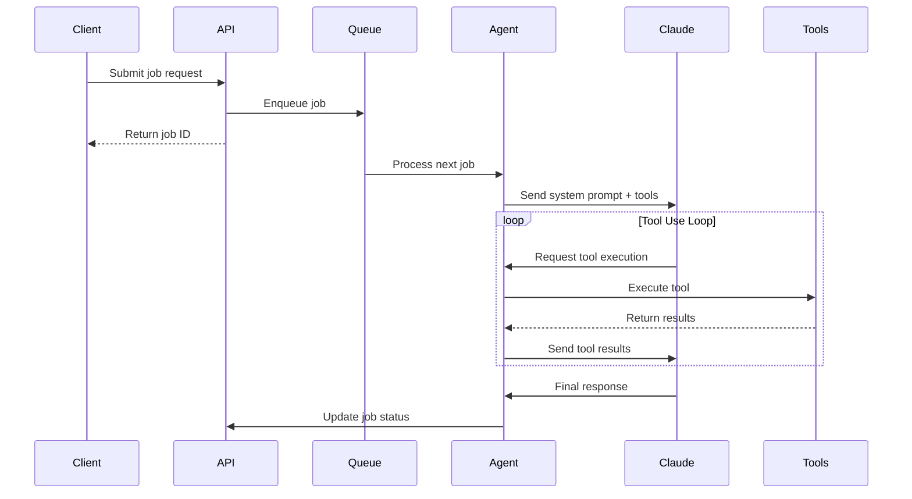
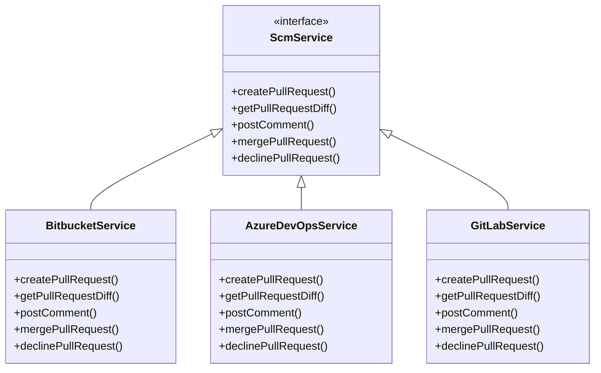
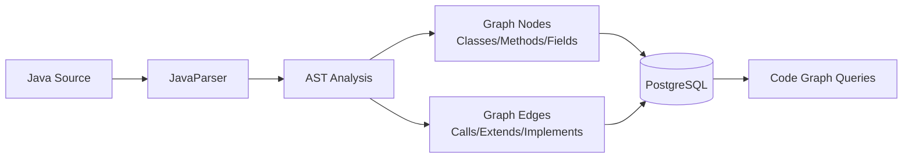
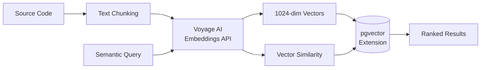

# Architecture Overview

The Code Agent Runner is a Quarkus-based application that provides AI-powered automation for software development workflows. It acts as a bridge between issue tracking systems, AI models, and git platforms to automate code fixes, reviews, and documentation.

## High-Level Architecture

```mermaid
flowchart TB
    subgraph "External Systems"
        JIRA[JIRA Cloud]
        GIT[Git Platforms<br/>Bitbucket/Azure DevOps/GitLab]
        ANTHROPIC[Anthropic Claude]
        AIKIDO[Aikido Security]
        TEAMS[Microsoft Teams]
        N8N[n8n Workflows]
        CONFLUENCE[Confluence Cloud]
        VOYAGE[Voyage AI<br/>Embeddings]
    end

    subgraph "Code Agent Runner"
        API[REST API Layer]
        AGENT[AI Agent Runner]
        QUEUE[Job Queue]
        TOOLS[Tool Registry]
        SCM[SCM Services]
        LINTER[Linter Services]
        GRAPH[Code Graph Builder]
        VECTOR[Vector Search]
    end

    subgraph "Data Layer"
        POSTGRES[(PostgreSQL<br/>with pgvector)]
        TEMP[/tmp Workspace<br/>Git Repos]
    end

    JIRA -->|Webhooks| API
    GIT -->|PR Webhooks| API
    API --> AGENT
    AGENT --> QUEUE
    AGENT --> TOOLS
    TOOLS --> SCM
    TOOLS --> LINTER
    TOOLS --> GRAPH
    TOOLS --> VECTOR
    AGENT --> ANTHROPIC
    SCM --> GIT
    AGENT --> AIKIDO
    AGENT --> TEAMS
    AGENT --> N8N
    AGENT --> CONFLUENCE
    VECTOR --> VOYAGE
    AGENT --> POSTGRES
    GRAPH --> POSTGRES
    VECTOR --> POSTGRES
    AGENT --> TEMP
```

## Core Components

### REST API Layer
- **Controllers**: Handle HTTP requests for job submission, status polling, settings management
- **Webhook Handlers**: Process incoming webhooks from JIRA, Bitbucket, Azure DevOps, GitLab
- **Security**: API key authentication, webhook signature verification
- **OpenAPI**: Swagger UI for API documentation

### AI Agent Runner
The core orchestration engine that manages the AI tool-use loop:



### Job Queue System
- **In-Memory Queue**: Thread-safe job processing with configurable concurrency
- **Job Types**: FIX, REVIEW, FIX_PR, GENERATE_TESTS, GENERATE_DOCS, HOOK, REPLY
- **Status Tracking**: PENDING, RUNNING, AWAITING_APPROVAL, COMPLETED, FAILED
- **Persistence**: Job metadata stored in PostgreSQL

### Tool Registry
Provides AI agent with access to development tools:

| Tool | Purpose | Guardrails |
|------|---------|------------|
| `list_files` | Directory exploration | Repository root only |
| `read_file` | File content access | Security path blocking |
| `write_file` | File modification | Doc files only in doc-gen mode |
| `search_code` | Grep-based search | Pattern validation |
| `query_code_graph` | AST-based queries | Workspace scoped |
| `semantic_search` | Vector similarity | Repository scoped |
| `run_command` | Shell execution | Allowed commands only |
| `fetch_url` | Documentation lookup | HTTPS URLs only |
| `publish_confluence` | Doc publishing | Authenticated access |

### SCM Services
Abstracted interface for multiple git platforms:



### Code Graph Builder
Analyzes Java source code to build AST-based dependency graphs:



### Vector Search
Semantic code search using embeddings:



## Data Flow

### Fix Job Flow
1. **Job Submission**: API receives fix request with JIRA key and repo URL
2. **Enrichment**: Fetch JIRA issue details, optionally resolve Aikido vulnerability context  
3. **Workspace Setup**: Clone git repository to temporary directory
4. **AI Processing**: Run Claude tool-use loop to analyze and fix issues
5. **Validation**: Execute build commands (Maven, npm) to verify changes
6. **PR Creation**: Push branch and create pull request on git platform
7. **JIRA Update**: Transition issue status and add progress comments
8. **Approval Flow**: Await human approval via n8n webhook integration

### Review Job Flow
1. **Webhook Trigger**: Git platform sends PR webhook
2. **Diff Analysis**: Compute changes between source and target branches
3. **Context Gathering**: Build code graph, analyze file relationships
4. **AI Review**: Generate comprehensive code review using Claude
5. **Comment Posting**: Post structured review comments to pull request
6. **Metrics Tracking**: Store review statistics and feedback

## Security & Compliance

### Guardrails
- **Blocked Paths**: Prevent modification of security-sensitive directories
- **Command Whitelist**: Restrict shell command execution to approved tools
- **File Limits**: Maximum changed files and lines per job
- **Timeout Protection**: Job-level and command-level timeouts

### Authentication
- **API Keys**: Shared secret for REST endpoint access
- **Webhook Signatures**: HMAC-SHA256 verification for incoming webhooks
- **Service Tokens**: Individual credentials for external service integration

## Deployment Architecture

```mermaid
flowchart TB
    subgraph "Container Environment"
        APP[Code Agent Runner<br/>Quarkus Application]
        WORK[/tmp Workspace<br/>Git Repositories]
    end
    
    subgraph "Database"
        PG[(PostgreSQL<br/>with pgvector)]
    end
    
    subgraph "External Dependencies"
        DOCKER[Docker<br/>Multi-platform build]
        ECR[AWS ECR<br/>Container Registry]
        TOOLS[Development Tools<br/>Maven, Node.js, .NET]
    end
    
    APP --> PG
    APP --> WORK
    APP --> TOOLS
    DOCKER --> ECR
    DOCKER --> APP
```

The application is containerized using Docker and can be deployed to any container orchestration platform. It requires:

- **Database**: PostgreSQL 13+ with pgvector extension
- **Compute**: 2+ CPU cores, 4GB+ RAM for concurrent job processing
- **Storage**: Temporary workspace for git repository clones
- **Network**: Outbound access to git platforms, AI APIs, and webhook endpoints

## Technology Stack

| Layer | Technologies |
|-------|-------------|
| **Application** | Quarkus 3.17.8, Java 17, JAX-RS, CDI |
| **AI Integration** | Anthropic Claude, Function Calling, Tool Use |
| **Database** | PostgreSQL, pgvector, Flyway migrations |
| **HTTP Client** | Quarkus REST Client, Jackson JSON |
| **Code Analysis** | JavaParser, AST analysis |
| **Search** | Voyage AI embeddings, vector similarity |
| **Build Tools** | Maven wrapper, Docker multi-stage |
| **Monitoring** | Quarkus health checks, OpenAPI/Swagger |