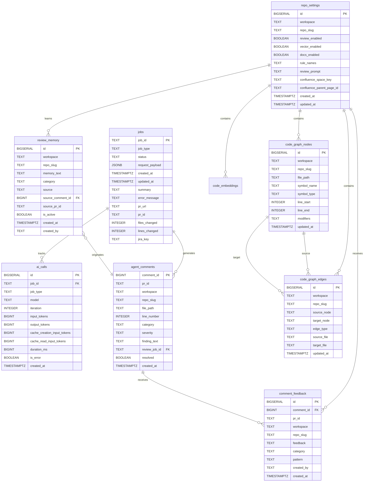

# Data Model

The Code Agent Runner uses PostgreSQL as its primary data store with Flyway for database migrations. The schema is designed to support concurrent job processing, code intelligence features, learning systems, and comprehensive metrics tracking.

## Database Schema Overview

The database consists of several functional areas:

- **Job Management**: Job queue, history, and status tracking
- **Code Intelligence**: AST-based code graphs and vector embeddings
- **Repository Management**: Per-repo settings and configurations
- **AI Integration**: API call tracking and cost metrics
- **Learning System**: Review memory and feedback collection
- **Audit & Metrics**: Comment tracking and quality metrics

## Core Tables

### jobs
Active job queue with status tracking and metadata.

| Column | Type | Constraints | Description |
|--------|------|-------------|-------------|
| job_id | TEXT | PRIMARY KEY | UUID identifier for the job |
| job_type | TEXT | NOT NULL | Type of job (RUN_FIX, REVIEW_PR, GENERATE_TESTS, etc.) |
| status | TEXT | NOT NULL | Current status (QUEUED, RUNNING, AWAITING_APPROVAL, etc.) |
| request_payload | JSONB | | Original request data as JSON |
| created_at | TIMESTAMPTZ | NOT NULL, DEFAULT now() | Job submission timestamp |
| updated_at | TIMESTAMPTZ | NOT NULL, DEFAULT now() | Last status update timestamp |
| summary | TEXT | | Job description or progress summary |
| error_message | TEXT | | Error details if job failed |
| pr_url | TEXT | | Generated pull request URL |
| pr_id | TEXT | | Pull request identifier |
| files_changed | INTEGER | NOT NULL, DEFAULT 0 | Number of files modified |
| lines_changed | INTEGER | NOT NULL, DEFAULT 0 | Number of lines modified |
| jira_key | TEXT | | Associated JIRA ticket |

**Indexes:**
- `idx_jobs_status` on `status`
- `idx_jobs_jira_key` on `jira_key` 
- `idx_jobs_created_at` on `created_at`

### job_history
Archived completed jobs for historical analysis and reporting.

| Column | Type | Constraints | Description |
|--------|------|-------------|-------------|
| job_id | TEXT | PRIMARY KEY | UUID from original jobs table |
| job_type | TEXT | NOT NULL | Type of completed job |
| status | TEXT | NOT NULL | Final job status |
| request_payload | JSONB | | Original request data |
| created_at | TIMESTAMPTZ | NOT NULL | Original creation timestamp |
| completed_at | TIMESTAMPTZ | NOT NULL, DEFAULT now() | Job completion timestamp |
| summary | TEXT | | Final job summary |
| error_message | TEXT | | Error details if applicable |
| pr_url | TEXT | | Generated pull request URL |
| pr_id | TEXT | | Pull request identifier |
| files_changed | INTEGER | NOT NULL, DEFAULT 0 | Files modified count |
| lines_changed | INTEGER | NOT NULL, DEFAULT 0 | Lines modified count |
| jira_key | TEXT | | Associated JIRA ticket |

## Repository Management

### repo_settings
Per-repository configuration and feature toggles.

| Column | Type | Constraints | Description |
|--------|------|-------------|-------------|
| id | BIGSERIAL | PRIMARY KEY | Auto-generated identifier |
| workspace | TEXT | NOT NULL | Git platform workspace/organization |
| repo_slug | TEXT | NOT NULL | Repository name |
| review_enabled | BOOLEAN | NOT NULL, DEFAULT TRUE | Enable automated PR review |
| vector_enabled | BOOLEAN | NOT NULL, DEFAULT FALSE | Enable semantic search indexing |
| docs_enabled | BOOLEAN | NOT NULL, DEFAULT TRUE | Enable documentation generation |
| rule_names | TEXT | | Comma-separated list of coding rules |
| review_prompt | TEXT | | Custom review prompt template |
| confluence_space_key | TEXT | | Confluence space for documentation |
| confluence_parent_page_id | TEXT | | Parent page ID for docs |
| disabled_hooks | TEXT | | Comma-separated disabled automation hooks |
| created_at | TIMESTAMPTZ | NOT NULL, DEFAULT now() | Settings creation timestamp |
| updated_at | TIMESTAMPTZ | NOT NULL, DEFAULT now() | Last update timestamp |

**Constraints:**
- `UNIQUE(workspace, repo_slug)` - One settings record per repository

**Indexes:**
- `idx_repo_settings_workspace` on `workspace`

## Code Intelligence

### code_graph_nodes
AST-extracted symbols for code analysis and impact assessment.

| Column | Type | Constraints | Description |
|--------|------|-------------|-------------|
| id | BIGSERIAL | PRIMARY KEY | Auto-generated identifier |
| workspace | TEXT | NOT NULL | Repository workspace |
| repo_slug | TEXT | NOT NULL | Repository name |
| file_path | TEXT | NOT NULL | Source file path |
| symbol_name | TEXT | NOT NULL | Class, method, or field name |
| symbol_type | TEXT | NOT NULL | Type (class, method, field, enum, interface) |
| line_start | INTEGER | | Symbol start line number |
| line_end | INTEGER | | Symbol end line number |
| modifiers | TEXT | | Access modifiers (public, private, static, etc.) |
| updated_at | TIMESTAMPTZ | NOT NULL, DEFAULT now() | Last index update |

**Constraints:**
- `UNIQUE(workspace, repo_slug, file_path, symbol_name)` - One record per symbol

**Indexes:**
- `idx_cgn_repo` on `workspace, repo_slug`
- `idx_cgn_symbol` on `workspace, repo_slug, file_path, symbol_name`

### code_graph_edges  
Relationships between code symbols for dependency analysis.

| Column | Type | Constraints | Description |
|--------|------|-------------|-------------|
| id | BIGSERIAL | PRIMARY KEY | Auto-generated identifier |
| workspace | TEXT | NOT NULL | Repository workspace |
| repo_slug | TEXT | NOT NULL | Repository name |
| source_node | TEXT | NOT NULL | Source symbol name |
| target_node | TEXT | NOT NULL | Target symbol name |
| edge_type | TEXT | NOT NULL | Relationship type (calls, extends, implements, imports) |
| source_file | TEXT | | Source symbol file path |
| target_file | TEXT | | Target symbol file path |
| updated_at | TIMESTAMPTZ | NOT NULL, DEFAULT now() | Last update timestamp |

**Constraints:**
- `UNIQUE(workspace, repo_slug, source_node, target_node, edge_type)` - One edge per relationship

**Indexes:**
- `idx_cge_target` on `workspace, repo_slug, target_node`
- `idx_cge_source` on `workspace, repo_slug, source_node`

### code_embeddings
Vector embeddings for semantic code search across repositories.

| Column | Type | Constraints | Description |
|--------|------|-------------|-------------|
| id | BIGSERIAL | PRIMARY KEY | Auto-generated identifier |
| workspace | TEXT | NOT NULL | Repository workspace |
| repo_slug | TEXT | NOT NULL | Repository name |
| file_path | TEXT | NOT NULL | Source file path |
| symbol_name | TEXT | NOT NULL | Symbol identifier |
| symbol_type | TEXT | NOT NULL | Symbol type (class, method, etc.) |
| source_text | TEXT | NOT NULL | Source code for the symbol |
| line_start | INTEGER | | Symbol start line |
| line_end | INTEGER | | Symbol end line |
| embedding | vector(1024) | NOT NULL | Voyage AI vector embedding |
| updated_at | TIMESTAMPTZ | NOT NULL, DEFAULT now() | Last embedding update |

**Constraints:**
- `UNIQUE(workspace, repo_slug, file_path, symbol_name)` - One embedding per symbol

**Indexes:**
- `idx_embeddings_repo` on `workspace, repo_slug`
- `idx_embeddings_vector` using IVFFlat for cosine similarity search

**Dependencies:**
- Requires `pgvector` extension for vector data type and indexing

## AI Integration & Metrics

### ai_calls
Comprehensive tracking of AI API usage for cost analysis and performance monitoring.

| Column | Type | Constraints | Description |
|--------|------|-------------|-------------|
| id | BIGSERIAL | PRIMARY KEY | Auto-generated identifier |
| job_id | TEXT | | Associated job identifier |
| job_type | TEXT | | Job type for aggregation |
| model | TEXT | NOT NULL | AI model used (e.g., claude-sonnet-4-20250514) |
| iteration | INTEGER | | Tool-use loop iteration number |
| input_tokens | BIGINT | NOT NULL, DEFAULT 0 | Input tokens consumed |
| output_tokens | BIGINT | NOT NULL, DEFAULT 0 | Output tokens generated |
| cache_creation_input_tokens | BIGINT | NOT NULL, DEFAULT 0 | Cache write tokens |
| cache_read_input_tokens | BIGINT | NOT NULL, DEFAULT 0 | Cache read tokens |
| stop_reason | TEXT | | API completion reason |
| tool_names | TEXT | | Comma-separated tools used |
| duration_ms | BIGINT | NOT NULL, DEFAULT 0 | API call duration |
| is_error | BOOLEAN | NOT NULL, DEFAULT FALSE | Whether call failed |
| error_message | TEXT | | Error details if applicable |
| created_at | TIMESTAMPTZ | NOT NULL, DEFAULT now() | API call timestamp |

**Indexes:**
- `idx_ai_calls_job_id` on `job_id`
- `idx_ai_calls_created_at` on `created_at`
- `idx_ai_calls_job_type` on `job_type`

## Learning & Review System

### review_memory
Team preferences and learned patterns for improved code review quality.

| Column | Type | Constraints | Description |
|--------|------|-------------|-------------|
| id | BIGSERIAL | PRIMARY KEY | Auto-generated identifier |
| workspace | TEXT | NOT NULL | Repository workspace |
| repo_slug | TEXT | NOT NULL | Repository name |
| memory_text | TEXT | NOT NULL | Learned preference or pattern |
| category | TEXT | | Finding category (Security, Code Quality, etc.) |
| source | TEXT | NOT NULL | How memory was created (manual, /learn, auto_suppress) |
| source_comment_id | BIGINT | | Originating comment ID if applicable |
| source_pr_id | TEXT | | Originating PR ID if applicable |
| is_active | BOOLEAN | NOT NULL, DEFAULT TRUE | Whether memory is currently used |
| created_at | TIMESTAMPTZ | NOT NULL, DEFAULT now() | Creation timestamp |
| created_by | TEXT | | User who created the memory |

**Indexes:**
- `idx_review_memory_repo` on `workspace, repo_slug, is_active`

### comment_feedback
Developer feedback on individual review findings for quality metrics.

| Column | Type | Constraints | Description |
|--------|------|-------------|-------------|
| id | BIGSERIAL | PRIMARY KEY | Auto-generated identifier |
| comment_id | BIGINT | NOT NULL | Platform comment identifier |
| pr_id | TEXT | NOT NULL | Pull request identifier |
| workspace | TEXT | NOT NULL | Repository workspace |
| repo_slug | TEXT | NOT NULL | Repository name |
| feedback | TEXT | NOT NULL | Feedback type (false_positive, helpful, disagree) |
| category | TEXT | | Original finding category |
| pattern | TEXT | | Normalized pattern for grouping |
| created_by | TEXT | NOT NULL | User who provided feedback |
| created_at | TIMESTAMPTZ | NOT NULL, DEFAULT now() | Feedback timestamp |

**Indexes:**
- `idx_comment_feedback_repo` on `workspace, repo_slug, feedback`
- `idx_comment_feedback_comment` on `comment_id`
- `idx_comment_feedback_pattern` on `workspace, repo_slug, pattern`

### agent_comments
Maps platform comment IDs to agent findings for reply tracking.

| Column | Type | Constraints | Description |
|--------|------|-------------|-------------|
| comment_id | BIGINT | PRIMARY KEY | Platform comment identifier |
| pr_id | TEXT | NOT NULL | Pull request identifier |
| workspace | TEXT | NOT NULL | Repository workspace |
| repo_slug | TEXT | NOT NULL | Repository name |
| file_path | TEXT | | File path for inline comments |
| line_number | INTEGER | | Line number for inline comments |
| category | TEXT | | Finding category |
| severity | TEXT | | Finding severity level |
| finding_text | TEXT | NOT NULL | Original finding description |
| review_job_id | TEXT | | Associated review job ID |
| project | TEXT | | Project identifier (added in V4) |
| resolved | BOOLEAN | NOT NULL, DEFAULT FALSE | Whether finding was resolved (added in V9) |
| created_at | TIMESTAMPTZ | NOT NULL, DEFAULT now() | Comment creation timestamp |

**Indexes:**
- `idx_agent_comments_pr` on `workspace, repo_slug, pr_id`

## Automation System

### automation_hooks
Configurable automation triggers for repository events.

| Column | Type | Constraints | Description |
|--------|------|-------------|-------------|
| id | BIGSERIAL | PRIMARY KEY | Auto-generated identifier |
| name | TEXT | NOT NULL, UNIQUE | Hook identifier |
| description | TEXT | | Human-readable description |
| enabled | BOOLEAN | NOT NULL, DEFAULT TRUE | Whether hook is active |
| trigger_type | TEXT | NOT NULL | Trigger mechanism (pr_event, schedule) |
| pr_event | TEXT | | PR event type for pr_event triggers |
| branch_pattern | TEXT | | Regex pattern for branch matching |
| cron_expr | TEXT | | Cron expression for scheduled triggers |
| action_type | TEXT | NOT NULL | Action to perform (FIX, REVIEW, etc.) |
| prompt | TEXT | NOT NULL | Instructions for the action |
| rule_names | TEXT | | Coding rules to apply |
| extra_rules | TEXT | | Additional instructions |
| target_branch | TEXT | | Target branch for changes |
| commit_direct | BOOLEAN | NOT NULL, DEFAULT FALSE | Whether to commit directly vs PR |
| created_at | TIMESTAMPTZ | NOT NULL, DEFAULT now() | Hook creation timestamp |
| updated_at | TIMESTAMPTZ | NOT NULL, DEFAULT now() | Last update timestamp |

**Pre-configured Hooks:**
- `update-readme`: Updates README.md after PR merges to develop branch

## Entity Relationships

## Data Flow Patterns

### Job Lifecycle
1. **Creation**: New job record in `jobs` table with QUEUED status
2. **Processing**: Status updates to RUNNING, AI calls tracked in `ai_calls`
3. **Completion**: Status updates to AWAITING_APPROVAL with PR metadata
4. **Resolution**: Final status (APPROVED/REJECTED) and archival to `job_history`

### Code Intelligence Updates
1. **Graph Building**: Repository clone triggers AST parsing
2. **Node Extraction**: Classes, methods, fields stored in `code_graph_nodes`
3. **Edge Creation**: Relationships stored in `code_graph_edges`  
4. **Vector Generation**: Embeddings created for `code_embeddings` (if enabled)
5. **Incremental Updates**: Only changed files re-indexed on subsequent operations

### Learning System Evolution
1. **Review Comments**: Agent findings tracked in `agent_comments`
2. **Developer Feedback**: `/fp` and `/learn` replies stored in `comment_feedback`
3. **Pattern Recognition**: Repeated false positives trigger auto-suppression
4. **Memory Creation**: Learned patterns stored in `review_memory`
5. **Future Application**: Memories injected into subsequent review prompts

## Performance Considerations

### Indexing Strategy
- **Primary Keys**: All tables use appropriate primary key types
- **Foreign Key Lookups**: Indexed on commonly joined columns
- **Time-based Queries**: Timestamp columns indexed for historical analysis
- **Vector Search**: IVFFlat indexing on embeddings for cosine similarity

### Data Retention
- **Active Jobs**: Kept in `jobs` until completion
- **Historical Data**: Moved to `job_history` for long-term analysis
- **AI Call Metrics**: Retained indefinitely for cost tracking
- **Code Intelligence**: Updated incrementally, full rebuilds as needed

### Scaling Patterns
- **Partitioning**: Time-based partitioning for `ai_calls` and `job_history`
- **Archival**: Old data can be moved to separate tables or external storage
- **Read Replicas**: Query-heavy operations can use read-only replicas
- **Connection Pooling**: Agroal provides efficient connection management