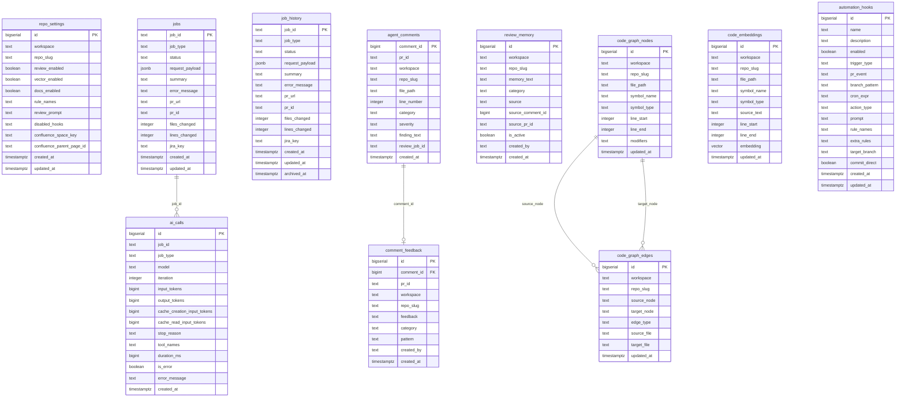

# Data Model

The Code Agent Runner uses PostgreSQL as its primary data store, with the pgvector extension for semantic search capabilities. The database schema is managed through Flyway migrations and designed to support multi-tenant repository operations, job tracking, AI interactions, and code intelligence features.

## Entity Relationship Diagram



## Core Tables

### Repository Settings (`repo_settings`)
Stores per-repository configuration and feature toggles.

| Column | Type | Description |
|--------|------|-------------|
| `id` | `bigserial` | Primary key |
| `workspace` | `text` | Git platform workspace/organization name |
| `repo_slug` | `text` | Repository name |
| `review_enabled` | `boolean` | Enable automatic PR reviews (default: `true`) |
| `vector_enabled` | `boolean` | Enable semantic code search (default: `false`) |
| `docs_enabled` | `boolean` | Enable documentation generation (default: `true`) |
| `rule_names` | `text` | Comma-separated list of rule names to load |
| `review_prompt` | `text` | Custom review instructions for this repository |
| `disabled_hooks` | `text` | Comma-separated list of disabled automation hooks |
| `confluence_space_key` | `text` | Confluence space for documentation publishing |
| `confluence_parent_page_id` | `text` | Parent page ID for nested documentation |
| `created_at` | `timestamptz` | Record creation timestamp |
| `updated_at` | `timestamptz` | Last modification timestamp |

**Indexes:**
- Unique index on `(workspace, repo_slug)`
- Index on `workspace`

### Job Management (`jobs`, `job_history`)
Tracks current and historical job executions.

#### Active Jobs (`jobs`)
| Column | Type | Description |
|--------|------|-------------|
| `job_id` | `text` | UUID primary key |
| `job_type` | `text` | Job type: `FIX`, `REVIEW`, `FIX_PR`, `GENERATE_TESTS`, `GENERATE_DOCS`, `HOOK`, `REPLY` |
| `status` | `text` | Status: `PENDING`, `RUNNING`, `AWAITING_APPROVAL`, `COMPLETED`, `FAILED` |
| `request_payload` | `jsonb` | Original request data as JSON |
| `summary` | `text` | Human-readable status description |
| `error_message` | `text` | Error details if job failed |
| `pr_url` | `text` | Generated pull request URL |
| `pr_id` | `text` | Pull request number |
| `files_changed` | `integer` | Number of files modified (default: 0) |
| `lines_changed` | `integer` | Number of lines changed (default: 0) |
| `jira_key` | `text` | Associated JIRA issue key |
| `created_at` | `timestamptz` | Job creation timestamp |
| `updated_at` | `timestamptz` | Last status update timestamp |

**Indexes:**
- Index on `status`
- Index on `jira_key`  
- Index on `created_at`

#### Job History (`job_history`)
Archived completed jobs with identical schema plus:
- `archived_at` - Archive timestamp

### Code Reviews

#### Review Comments (`agent_comments`)
Stores AI-generated code review findings.

| Column | Type | Description |
|--------|------|-------------|
| `comment_id` | `bigint` | External platform comment ID (primary key) |
| `pr_id` | `text` | Pull request identifier |
| `workspace` | `text` | Repository workspace |
| `repo_slug` | `text` | Repository name |
| `file_path` | `text` | File path (null for general comments) |
| `line_number` | `integer` | Line number (null for file-level comments) |
| `category` | `text` | Review category (e.g., 'security', 'performance') |
| `severity` | `text` | Finding severity level |
| `finding_text` | `text` | Comment content |
| `review_job_id` | `text` | Associated job ID |
| `created_at` | `timestamptz` | Comment creation timestamp |

**Indexes:**
- Index on `(workspace, repo_slug, pr_id)`

#### Comment Feedback (`comment_feedback`)
Developer feedback on review quality for metrics and improvement.

| Column | Type | Description |
|--------|------|-------------|
| `id` | `bigserial` | Primary key |
| `comment_id` | `bigint` | Foreign key to `agent_comments` |
| `pr_id` | `text` | Pull request identifier |
| `workspace` | `text` | Repository workspace |
| `repo_slug` | `text` | Repository name |
| `feedback` | `text` | Feedback type: `false_positive`, `helpful`, `disagree` |
| `category` | `text` | Review category (copied from original comment) |
| `pattern` | `text` | Normalized description for duplicate detection |
| `created_by` | `text` | Developer providing feedback |
| `created_at` | `timestamptz` | Feedback timestamp |

**Indexes:**
- Index on `(workspace, repo_slug, feedback)`
- Index on `comment_id`
- Index on `(workspace, repo_slug, pattern)`

#### Review Memory (`review_memory`)
Persistent context for improving future reviews.

| Column | Type | Description |
|--------|------|-------------|
| `id` | `bigserial` | Primary key |
| `workspace` | `text` | Repository workspace |
| `repo_slug` | `text` | Repository name |
| `memory_text` | `text` | Context description |
| `category` | `text` | Memory category for retrieval |
| `source` | `text` | How this context was learned |
| `source_comment_id` | `bigint` | Originating comment if applicable |
| `source_pr_id` | `text` | Originating pull request |
| `is_active` | `boolean` | Whether to include in future reviews |
| `created_by` | `text` | User who created the memory |
| `created_at` | `timestamptz` | Memory creation timestamp |

**Indexes:**
- Index on `(workspace, repo_slug, is_active)`

### AI Integration (`ai_calls`)
Tracks all AI API calls for cost monitoring and optimization.

| Column | Type | Description |
|--------|------|-------------|
| `id` | `bigserial` | Primary key |
| `job_id` | `text` | Associated job ID |
| `job_type` | `text` | Job type for categorization |
| `model` | `text` | AI model used (e.g., `claude-sonnet-4-20250514`) |
| `iteration` | `integer` | Tool-use loop iteration number |
| `input_tokens` | `bigint` | Input tokens consumed |
| `output_tokens` | `bigint` | Output tokens generated |
| `cache_creation_input_tokens` | `bigint` | Tokens written to cache |
| `cache_read_input_tokens` | `bigint` | Tokens read from cache |
| `stop_reason` | `text` | Why the call ended |
| `tool_names` | `text` | Comma-separated list of tools used |
| `duration_ms` | `bigint` | API call duration in milliseconds |
| `is_error` | `boolean` | Whether the call failed |
| `error_message` | `text` | Error details if applicable |
| `created_at` | `timestamptz` | API call timestamp |

**Indexes:**
- Index on `job_id`
- Index on `created_at`
- Index on `job_type`

## Code Intelligence

### Code Graph (`code_graph_nodes`, `code_graph_edges`)
AST-based representation of code structure and dependencies.

#### Graph Nodes (`code_graph_nodes`)
| Column | Type | Description |
|--------|------|-------------|
| `id` | `bigserial` | Primary key |
| `workspace` | `text` | Repository workspace |
| `repo_slug` | `text` | Repository name |
| `file_path` | `text` | Source file path |
| `symbol_name` | `text` | Class/method/field name |
| `symbol_type` | `text` | Symbol type: `CLASS`, `METHOD`, `FIELD`, `INTERFACE` |
| `line_start` | `integer` | Starting line number |
| `line_end` | `integer` | Ending line number |
| `modifiers` | `text` | Access modifiers and annotations |
| `updated_at` | `timestamptz` | Last analysis timestamp |

**Indexes:**
- Unique index on `(workspace, repo_slug, file_path, symbol_name)`
- Index on `(workspace, repo_slug)`

#### Graph Edges (`code_graph_edges`)
| Column | Type | Description |
|--------|------|-------------|
| `id` | `bigserial` | Primary key |
| `workspace` | `text` | Repository workspace |
| `repo_slug` | `text` | Repository name |
| `source_node` | `text` | Source symbol name |
| `target_node` | `text` | Target symbol name |
| `edge_type` | `text` | Relationship type: `CALLS`, `EXTENDS`, `IMPLEMENTS`, `USES` |
| `source_file` | `text` | Source file path |
| `target_file` | `text` | Target file path |
| `updated_at` | `timestamptz` | Last analysis timestamp |

**Indexes:**
- Unique index on `(workspace, repo_slug, source_node, target_node, edge_type)`
- Index on `(workspace, repo_slug, target_node)`
- Index on `(workspace, repo_slug, source_node)`

### Vector Embeddings (`code_embeddings`)
Semantic search using pgvector for code similarity.

| Column | Type | Description |
|--------|------|-------------|
| `id` | `bigserial` | Primary key |
| `workspace` | `text` | Repository workspace |
| `repo_slug` | `text` | Repository name |
| `file_path` | `text` | Source file path |
| `symbol_name` | `text` | Symbol name |
| `symbol_type` | `text` | Symbol type |
| `source_text` | `text` | Original source code text |
| `line_start` | `integer` | Starting line number |
| `line_end` | `integer` | Ending line number |
| `embedding` | `vector(1024)` | 1024-dimensional embedding vector |
| `updated_at` | `timestamptz` | Last embedding generation timestamp |

**Indexes:**
- Unique index on `(workspace, repo_slug, file_path, symbol_name)`
- Index on `(workspace, repo_slug)`
- IVFFlat index on `embedding` using cosine distance for similarity search

**Requirements:**
- PostgreSQL pgvector extension
- Vector dimensions must be exactly 1024 (Voyage AI model)

### Automation Hooks (`automation_hooks`)
Configurable triggers for automated job execution.

| Column | Type | Description |
|--------|------|-------------|
| `id` | `bigserial` | Primary key |
| `name` | `text` | Unique hook name |
| `description` | `text` | Human-readable description |
| `enabled` | `boolean` | Whether hook is active |
| `trigger_type` | `text` | Trigger type: `pr_event`, `cron`, `push` |
| `pr_event` | `text` | PR event type (e.g., `pullrequest:fulfilled`) |
| `branch_pattern` | `text` | Regex pattern for branch matching |
| `cron_expr` | `text` | Cron expression for scheduled execution |
| `action_type` | `text` | Job type to execute |
| `prompt` | `text` | Task prompt for the AI agent |
| `rule_names` | `text` | Comma-separated rule names |
| `extra_rules` | `text` | Additional rule text |
| `target_branch` | `text` | Target branch for PR creation |
| `commit_direct` | `boolean` | Whether to commit directly vs create PR |
| `created_at` | `timestamptz` | Hook creation timestamp |
| `updated_at` | `timestamptz` | Last modification timestamp |

**Constraints:**
- Unique constraint on `name`

## Database Configuration

### Connection Settings
```properties
quarkus.datasource.db-kind=postgresql
quarkus.datasource.jdbc.url=jdbc:postgresql://localhost:5432/code_agent
quarkus.datasource.username=code_agent
quarkus.datasource.password=${DATABASE_PASSWORD}
```

### Required Extensions
- **pgvector**: For vector similarity search
  ```sql
  CREATE EXTENSION IF NOT EXISTS vector;
  ```

### Migration Management
- **Tool**: Flyway
- **Location**: `src/main/resources/db/migration/`
- **Naming**: `V{version}__{description}.sql`
- **Auto-run**: Enabled via `quarkus.flyway.migrate-at-start=true`

### Performance Considerations
- Vector similarity queries use IVFFlat index with 100 lists
- Code graph queries leverage composite indexes on workspace/repo
- AI calls table partitioning recommended for high-volume deployments
- Job history archival process recommended for long-running instances