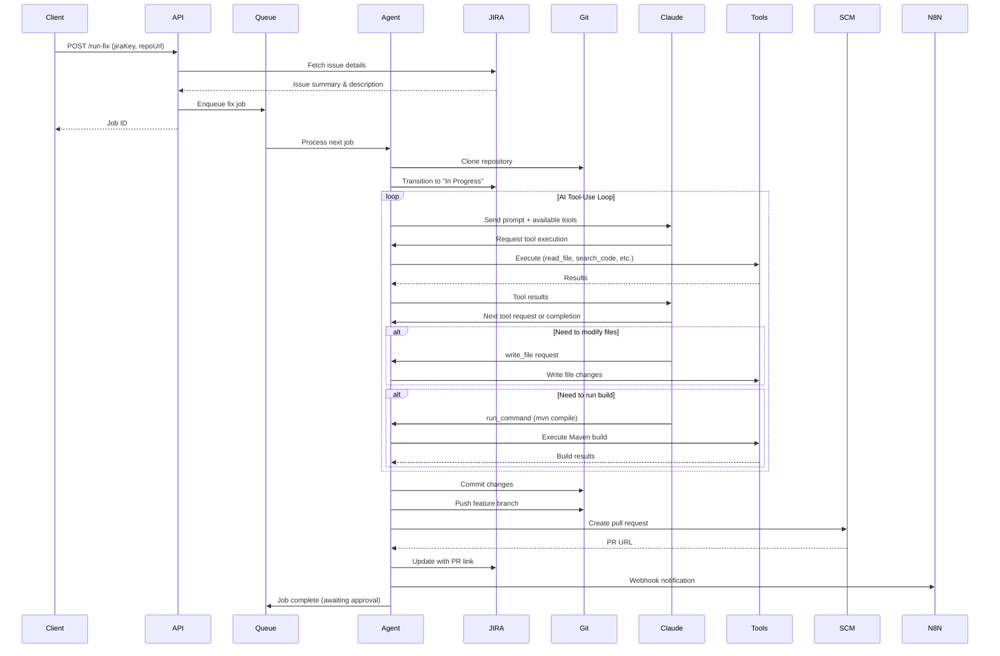
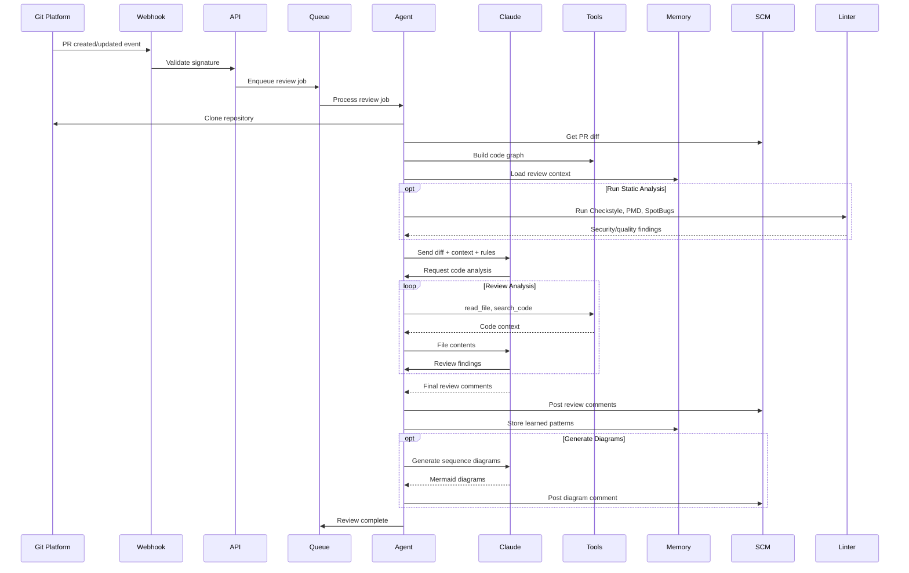
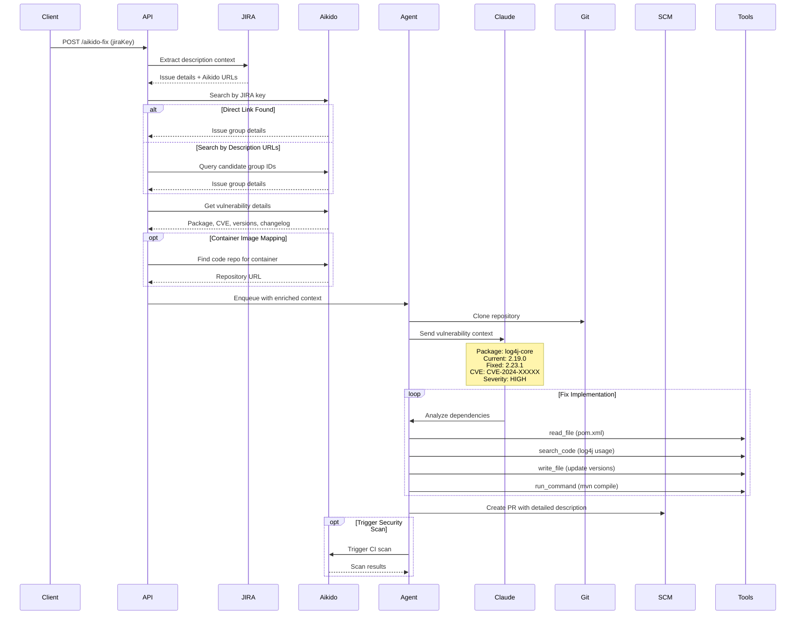
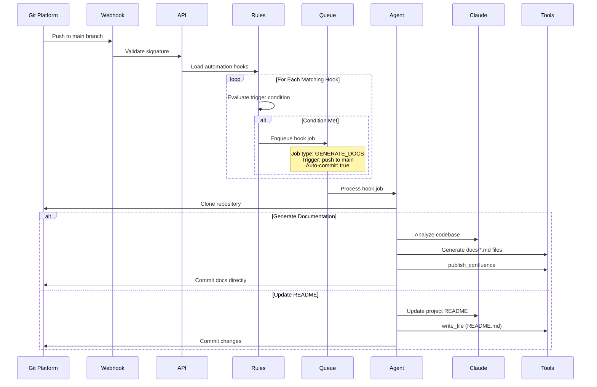
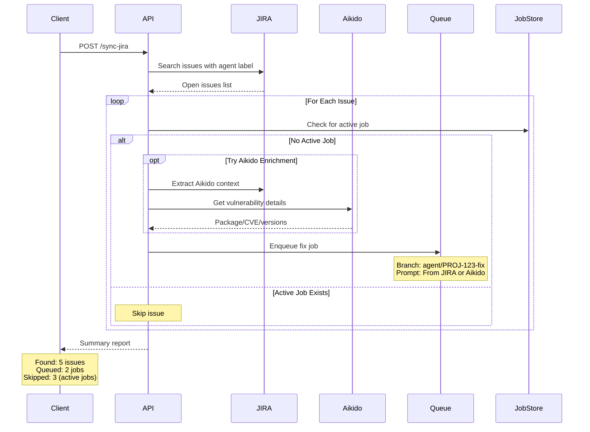
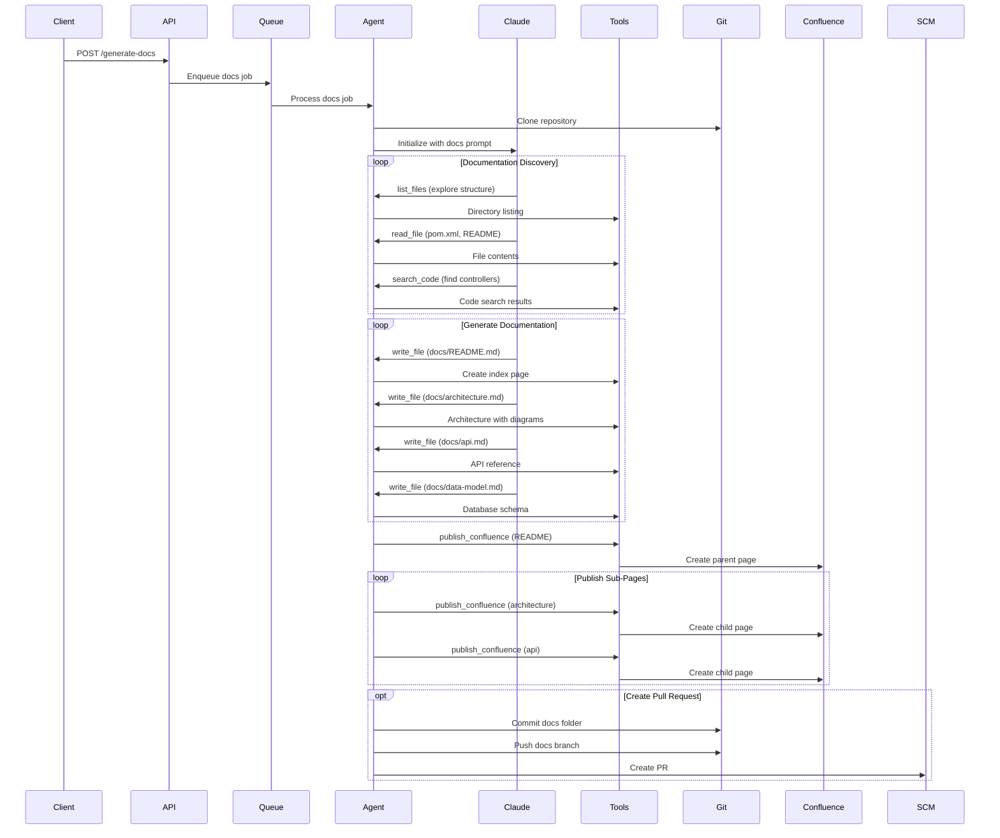
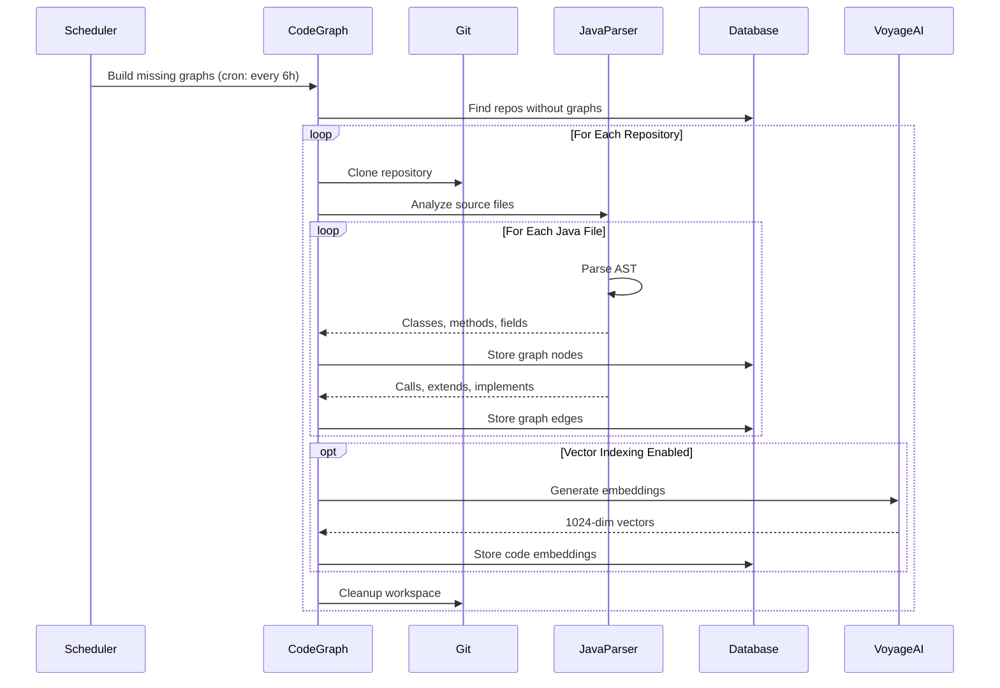
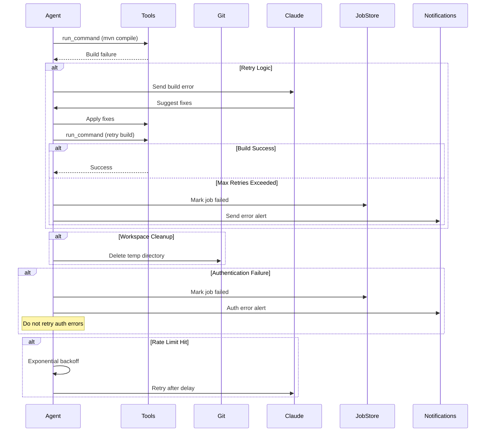

# Key Business Flows

This document outlines the most important workflows in the Code Agent Runner system, illustrating how different components interact to deliver automated code fixes, reviews, and documentation generation.

## Fix Job Lifecycle

The core automation flow that processes JIRA issues and creates pull requests with fixes.

## Pull Request Review Flow

Automated code review triggered by git platform webhooks.

## Aikido Security Integration Flow

Enhanced vulnerability fix workflow using Aikido Security platform integration.

## Webhook-Triggered Automation

Event-driven job execution based on repository events.

## JIRA Synchronization Flow

Bulk processing of open JIRA issues with agent labels.

## Documentation Generation Flow

Comprehensive project documentation creation with Confluence publishing.

## Code Graph Building Flow

AST analysis and dependency graph construction for semantic code understanding.

## Error Handling and Recovery

Common error scenarios and recovery mechanisms.

## Key Flow Characteristics

### Asynchronous Processing
- All long-running operations use job queue
- Status polling for real-time updates
- Webhook callbacks for completion notifications

### Error Resilience  
- Automatic retries with exponential backoff
- Graceful degradation when external services unavailable
- Comprehensive error logging and alerting

### Multi-Tenant Security
- Repository-scoped permissions and data isolation
- Webhook signature verification
- API key authentication for sensitive operations

### Scalability Patterns
- Configurable concurrency limits
- Resource cleanup after job completion
- Database connection pooling and indexing

### Integration Points
- **Git Platforms**: Repository cloning, PR management, webhook delivery
- **JIRA**: Issue tracking, status transitions, progress comments  
- **AI Services**: Claude for reasoning, Voyage AI for embeddings
- **Security Tools**: Aikido for vulnerability context, static analyzers
- **Collaboration**: Confluence publishing, Teams notifications, n8n workflows