# Key Business Flows

This document describes the most important workflows in the Code Agent Runner system. Each flow is illustrated with sequence diagrams and includes detailed explanations of the process steps and decision points.

## Fix Job Lifecycle

The fix job workflow is the core business process, handling everything from initial job submission through final PR approval and JIRA closure.

### Overview

A fix job takes a JIRA issue and automatically generates code changes to resolve it, creating a pull request for human review and approval.

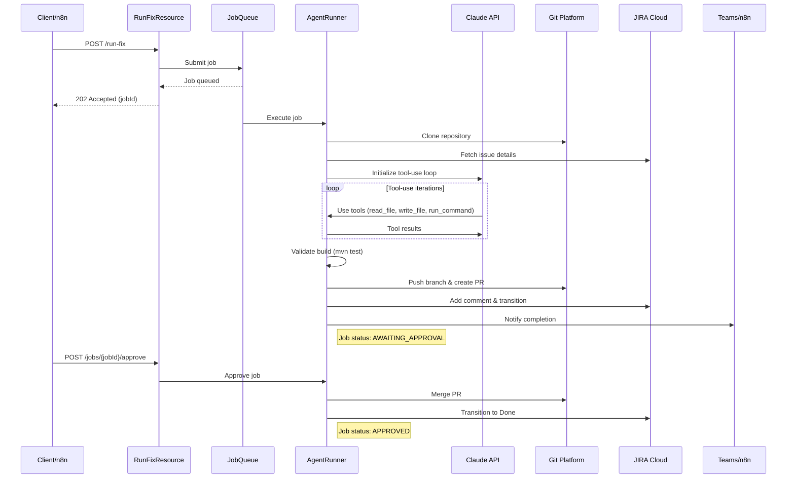

### Detailed Steps

1. **Job Submission**: Client submits job via REST API with repository URL, branch name, and JIRA key
2. **Queue Processing**: Job enters FIFO queue, processed when slot available
3. **Repository Setup**: Clone repo, checkout target branch, load coding rules
4. **Context Resolution**: Fetch JIRA issue details and any Aikido vulnerability context
5. **AI Processing**: Claude uses tools to explore code, make changes, and validate
6. **Build Validation**: Run Maven tests to ensure changes don't break build
7. **PR Creation**: Push branch and create pull request with detailed description
8. **Notification**: Update JIRA with progress and notify stakeholders
9. **Human Approval**: Job waits in AWAITING_APPROVAL status
10. **Completion**: On approval, merge PR and transition JIRA to Done

### Job States

| State | Description | Next States |
|-------|-------------|-------------|
| `QUEUED` | Waiting in job queue | `RUNNING`, `FAILED` |
| `RUNNING` | Active processing by agent | `AWAITING_APPROVAL`, `FAILED` |
| `AWAITING_APPROVAL` | PR created, waiting for human review | `APPROVED`, `REJECTED` |
| `APPROVED` | PR merged successfully | (final state) |
| `REJECTED` | PR declined by human reviewer | (final state) |
| `FAILED` | Job failed during processing | (final state) |

## Code Review Workflow

The AI-powered code review process analyzes pull requests for security, design quality, and best practices.

### Overview

When a PR is created or updated, the system automatically performs a comprehensive code review and posts findings as inline comments.

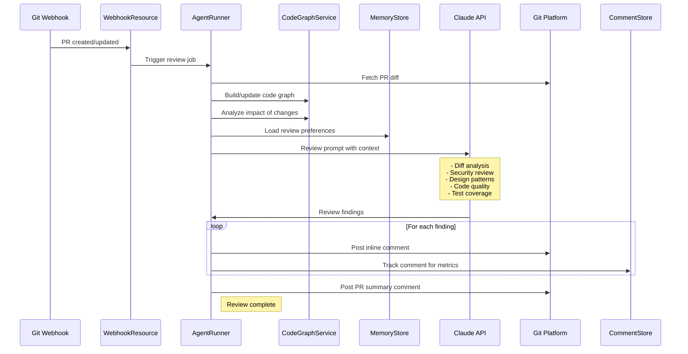

### Review Context Building

Before conducting the review, the system builds rich context:

1. **Code Graph Analysis**: Identify which symbols are modified and their dependencies
2. **Impact Assessment**: Find all callers and implementations of changed code
3. **Memory Integration**: Load team preferences and learned patterns
4. **False Positive Suppression**: Apply auto-suppression rules from previous feedback

### Review Coverage Areas

The AI review focuses on these key areas:

- **Security**: Injection vulnerabilities, authentication issues, data exposure
- **Design**: SOLID principles, separation of concerns, API design
- **Code Quality**: Naming conventions, complexity, error handling
- **Testing**: Coverage gaps, missing edge cases, test quality
- **Performance**: Inefficient algorithms, resource usage, caching opportunities
- **Best Practices**: Framework conventions, idiomatic patterns

## Developer Interaction Flow

Developers can interact with review comments using special commands and natural language.

### Overview

When a developer replies to an agent review comment, the system classifies the intent and takes appropriate action.

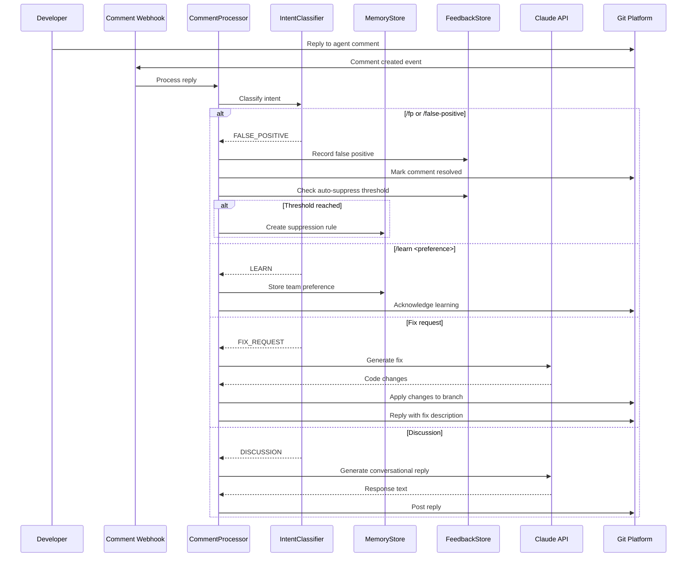

### Supported Reply Types

| Reply Pattern | Action | Example |
|---------------|--------|---------|
| `/fp` or `/false-positive` | Mark as false positive, auto-suppress after threshold | `/fp` |
| `/learn <preference>` | Store team preference | `/learn Prefer streams over loops for collection processing` |
| Natural language fix | Generate and apply code fix | `Please add null check here` |
| Natural language discussion | Conversational reply | `Why is this approach better?` |

## Aikido Security Integration Flow

The Aikido-enhanced fix workflow provides vulnerability-specific context for more effective remediation.

### Overview

Starting from a JIRA ticket, the system enriches the context with vulnerability details from Aikido Security.

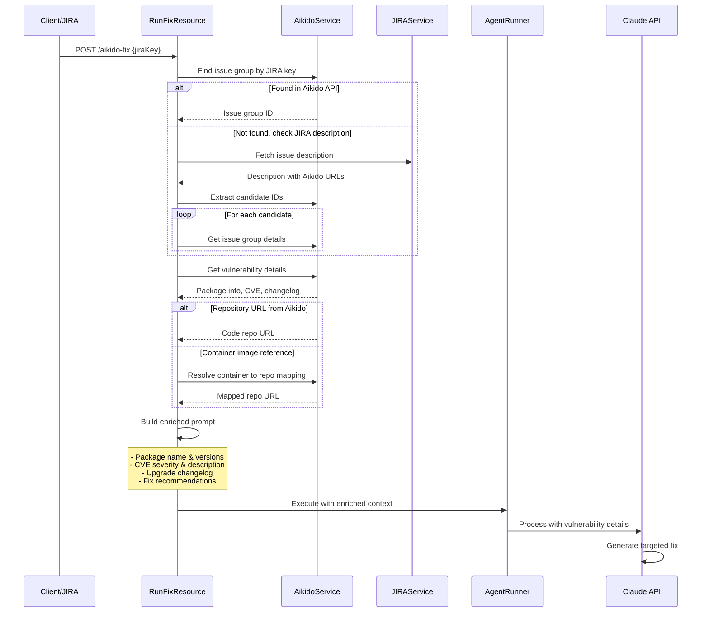

### Resolution Strategies

The system uses multiple strategies to resolve Aikido context:

1. **Direct API Lookup**: Search Aikido for issues linked to the JIRA key
2. **JIRA Description Parsing**: Extract Aikido URLs from ticket descriptions
3. **Direct Issue ID**: Use provided `aikidoGroupId` parameter
4. **Container Mapping**: Map container images to source repositories

### Enriched Context

The Aikido integration provides:

- **Package Information**: Name, current version, recommended fix version
- **CVE Details**: Severity score, description, affected components
- **Changelog**: Summary of changes between versions
- **Fix Guidance**: Aikido-specific remediation recommendations

## Webhook Processing Flow

The system handles various webhook events from external platforms to trigger automated actions.

### JIRA Issue Assignment Flow

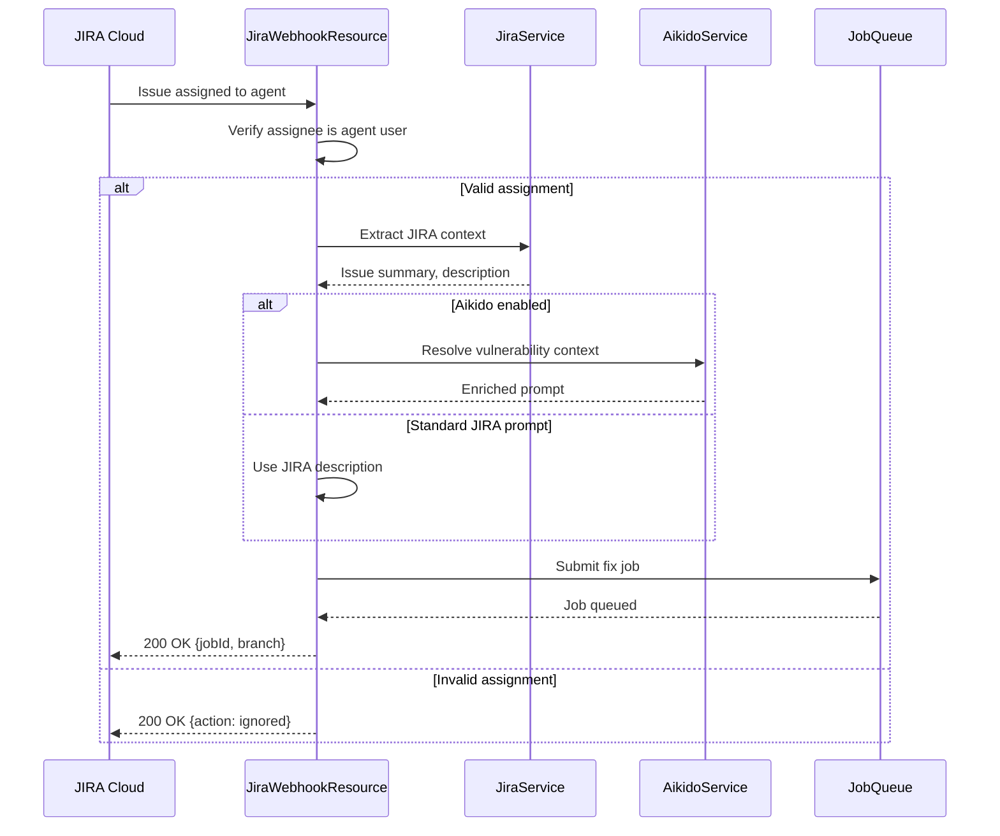

### Git Platform PR Webhook Flow

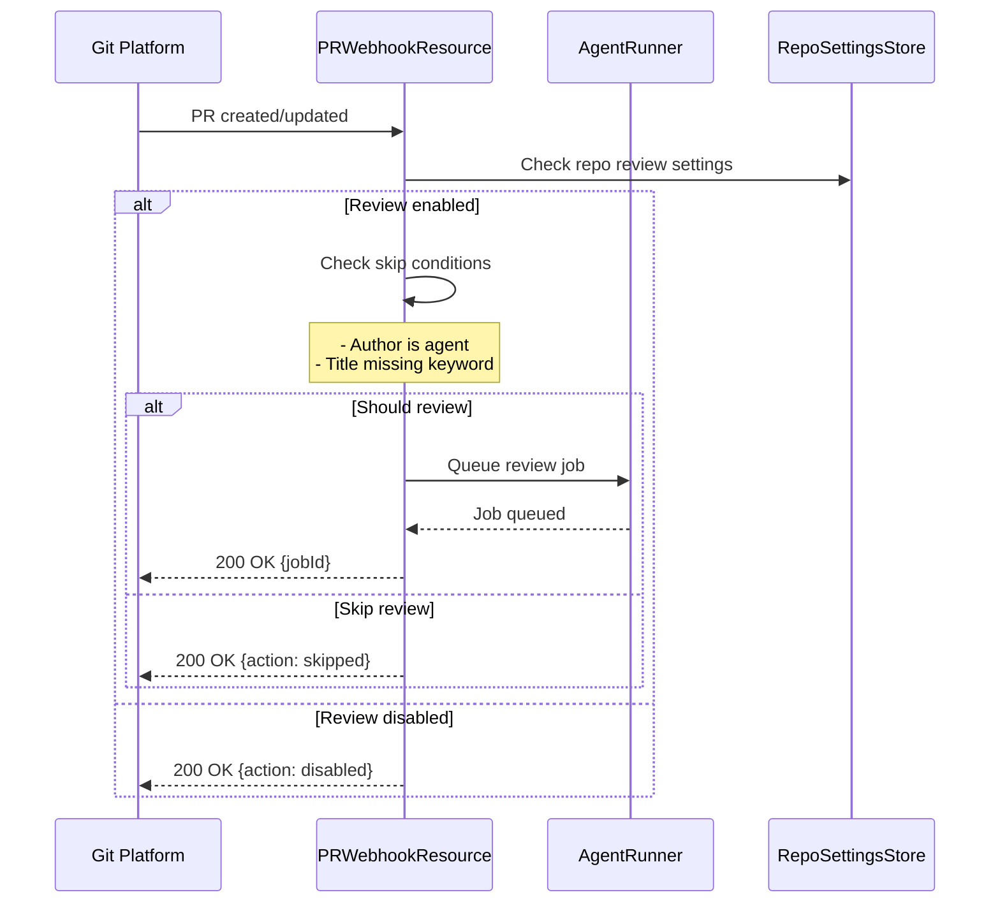

## Vector Search and Code Intelligence Flow

The system builds and maintains code graphs with vector embeddings for semantic search capabilities.

### Code Graph Building Flow

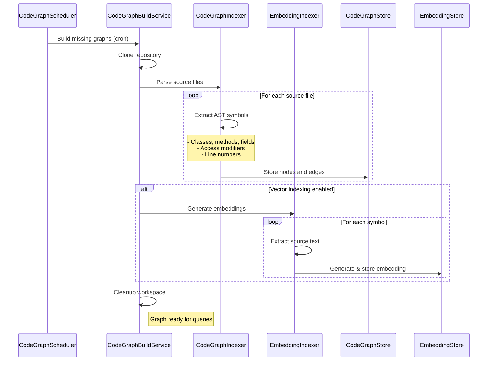

### Semantic Search Flow

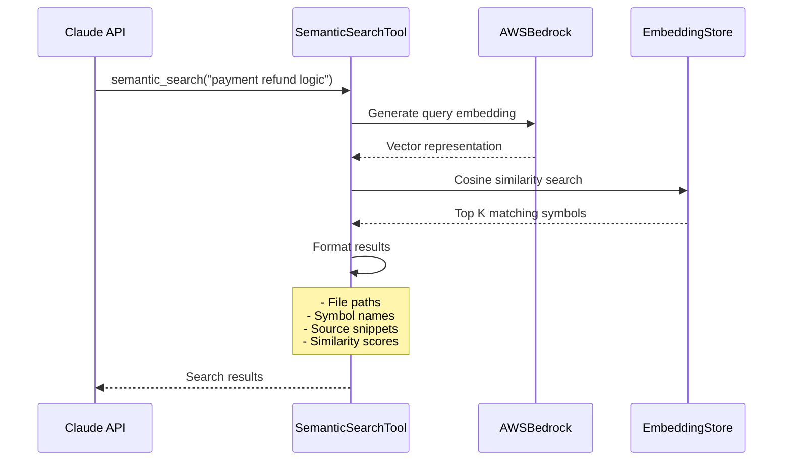

## Learning and Quality Improvement Flow

The system continuously learns from developer feedback to improve review quality.

### False Positive Auto-Suppression Flow

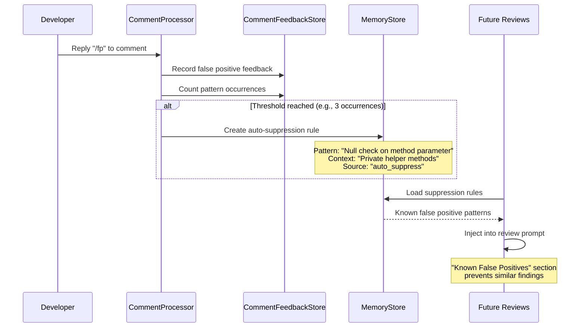

### Review Quality Metrics Flow

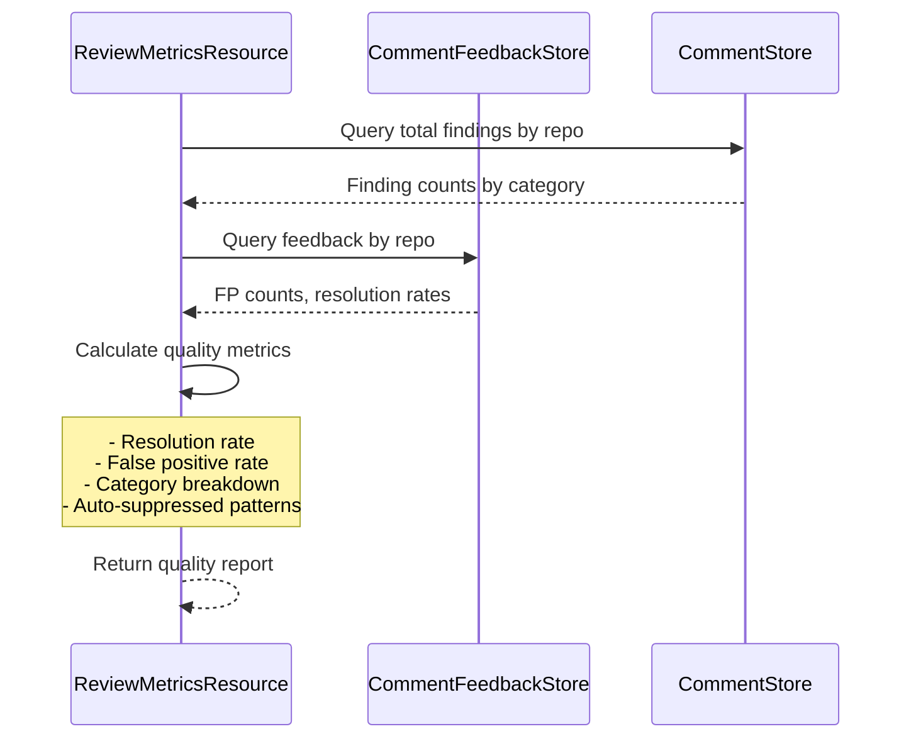

## Job Queue and Concurrency Management

The system uses a sophisticated job queue to manage concurrent processing while respecting resource limits.

### Job Queue Processing Flow

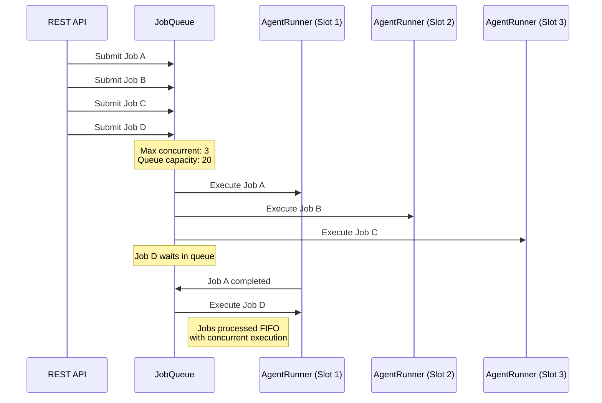

### Guardrails and Safety Controls

Every job execution is subject to multiple safety controls:

1. **Path Restrictions**: Block modifications to sensitive directories
2. **Command Allowlist**: Only permit safe commands like `mvn`, `git diff`
3. **Change Limits**: Cap maximum files and lines modified
4. **Timeout Controls**: Prevent runaway jobs from consuming resources
5. **Build Validation**: Ensure changes don't break compilation or tests

## Error Handling and Recovery

The system includes comprehensive error handling and recovery mechanisms.

### Job Failure Recovery Flow

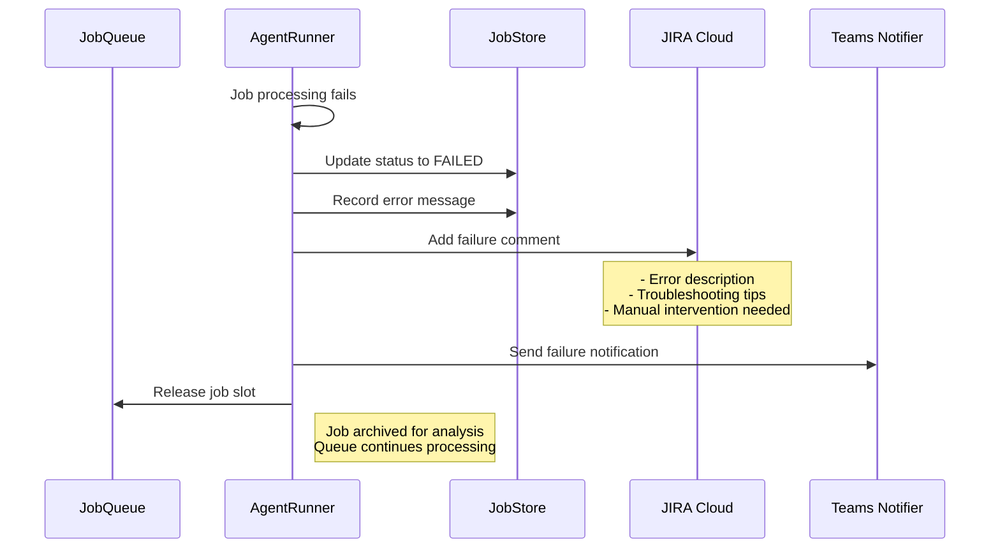

This comprehensive flow documentation provides insight into how the Code Agent Runner orchestrates complex workflows while maintaining reliability and quality. Each flow is designed with proper error handling, monitoring, and recovery mechanisms to ensure robust operation in production environments.